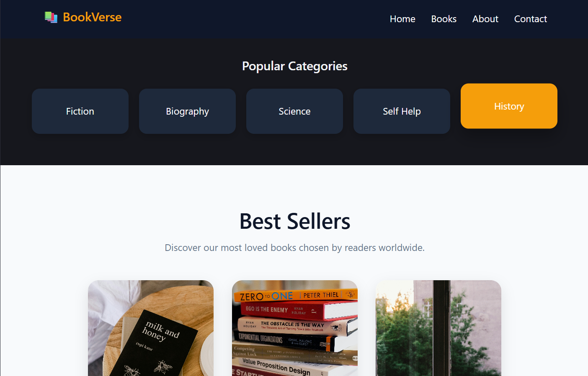
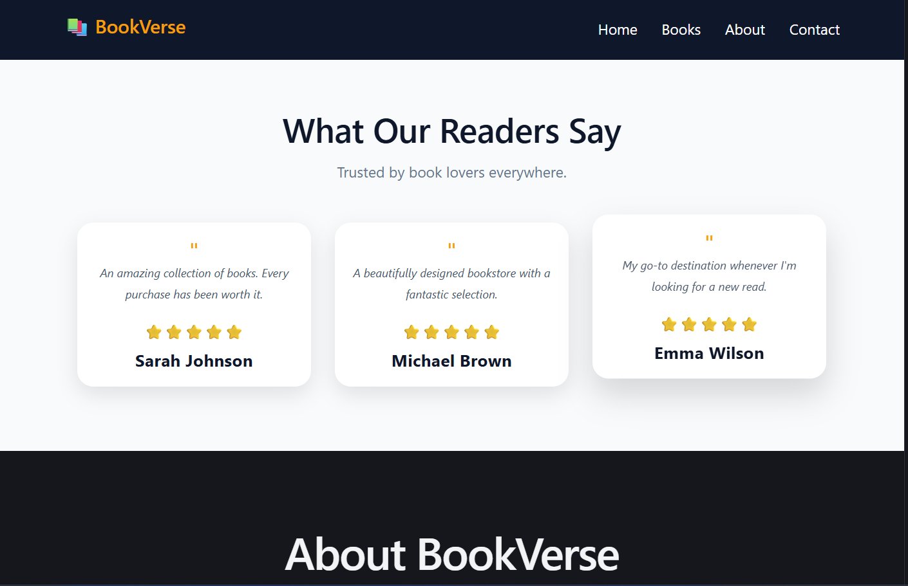
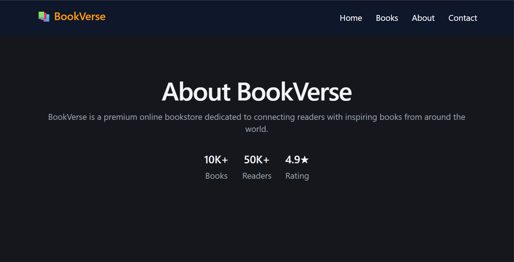
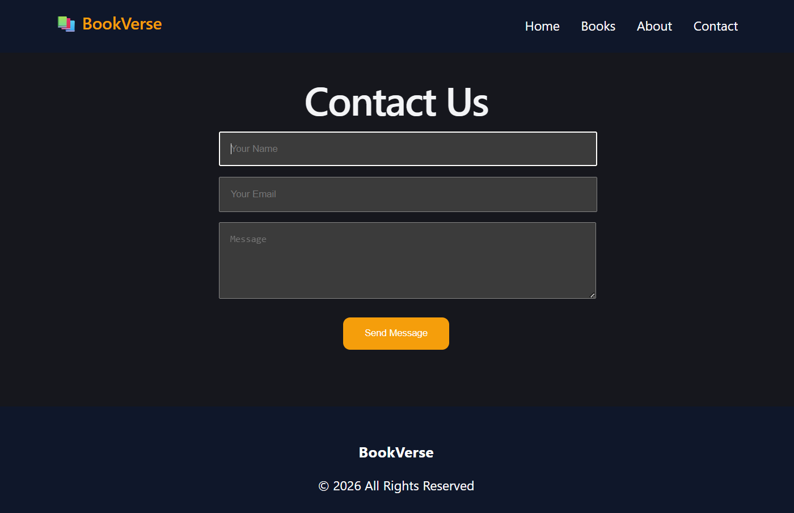

# BookVerse 📚

BookVerse is a web application designed to help book lovers discover their next favorite read. Users can explore a massive collection of books across various genres and browse popular categories easily.

## 🚀 Features
* **Interactive Homepage:** A beautifully designed hero section to welcome users.
* **Explore Collection:** An easy way to navigate through thousands of available books.
* **Popular Categories:** Organized sections to filter books by specific genres.
* **Responsive Design:** Optimized for smooth browsing across both desktop and mobile devices.

---

## 📸 Application Screenshots

Below is a preview of the working application:

## Homepage

## Categories

## Book Collection

## Review

## About Us

## Contact

---

## 🛠️ Built With
* **React** - JavaScript library for building user interfaces
* **CSS / Tailwind CSS** - For styling and responsive design
*